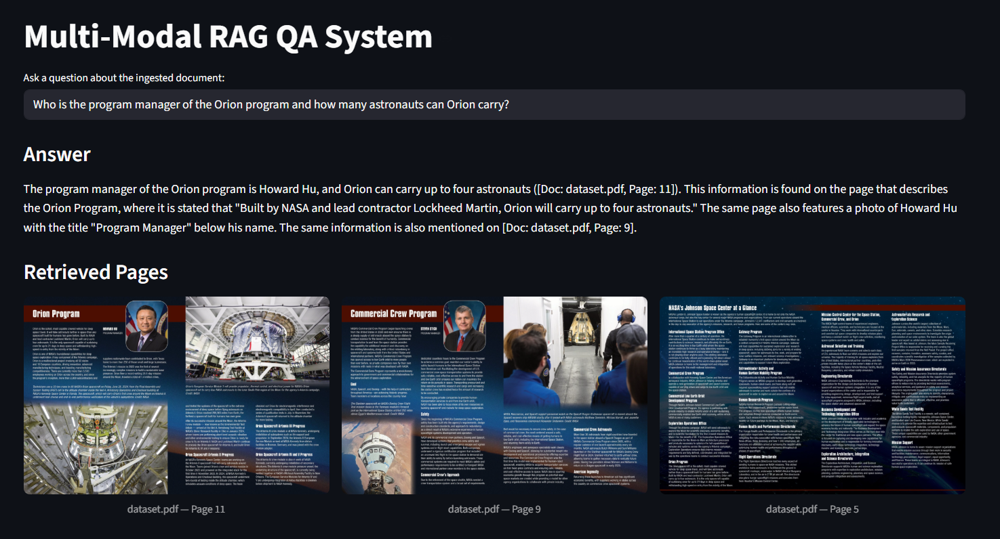

# Multi-Modal RAG-Based QA System

A vision-first Retrieval-Augmented Generation system that answers questions about complex PDF documents containing text, tables, charts, and images.

**DSAI 413 -- Assignment 1 | SPR 26 | Mohammed Taha | 202201788**

## Architecture

```
PDF --> Page Images --> ColQwen2.5 Embeddings --> Qdrant Cloud (MaxSim) --> Top-K Pages --> LLM Answer
         (PyMuPDF)       (3B, 4-bit quantized)    (multi-vector 128d)                      (Llama 4 Maverick)
```

## Demo



## Setup

```bash
# Install dependencies
pip install torch transformers colpali-engine qdrant-client pymupdf streamlit openai bitsandbytes pydantic-settings pillow

# Configure .env
QDRANT_URL=<your-qdrant-cloud-url>
QDRANT_API_KEY=<your-key>
KIMI_API_KEY=<your-nvidia-nim-key>
```

## Usage

```bash
# Ingest a PDF
python main.py ingest dataset.pdf

# Launch the QA interface
python main.py serve

# Run evaluation benchmark
python main.py benchmark
```

## Project Structure

```
ingestion/          PDF parsing and embedding pipeline
  pdf_converter.py    Renders PDF pages to images (PyMuPDF)
  embedder.py         ColQwen2.5 encoding + Qdrant upsert

retrieval/          Query encoding and vector search
  retriever.py        ColQwen2.5 query embedding + MaxSim retrieval

generation/         Answer generation with citations
  generator.py        Multimodal LLM prompt building (Llama 4 Maverick)

evaluation/         Benchmark suite
  benchmark.py        Hit@1 accuracy across text/table/image queries
  queries.json        12 benchmark queries with expected pages

interface/          Web UI
  app.py              Streamlit chatbot with source page display

compat.py           Windows memory patches for model loading
config.py           Environment configuration
main.py             CLI entry point
```

## Benchmark Results

| Modality | Queries | Hit@1 | Accuracy |
|----------|---------|-------|----------|
| Text     | 6       | 6     | **100%** |
| Table    | 4       | 3     | **75%**  |
| Image    | 2       | 2     | **100%** |
| **Overall** | **12** | **11** | **92%** |

## Tech Stack

- **Embedding**: ColQwen2.5-v0.2 (ColPali late interaction, 128-dim multi-vectors)
- **Vector DB**: Qdrant Cloud (MaxSim cosine similarity)
- **LLM**: Llama 4 Maverick 17B via NVIDIA NIM
- **Quantization**: BitsAndBytes 4-bit (fits on 4GB VRAM)
- **UI**: Streamlit
